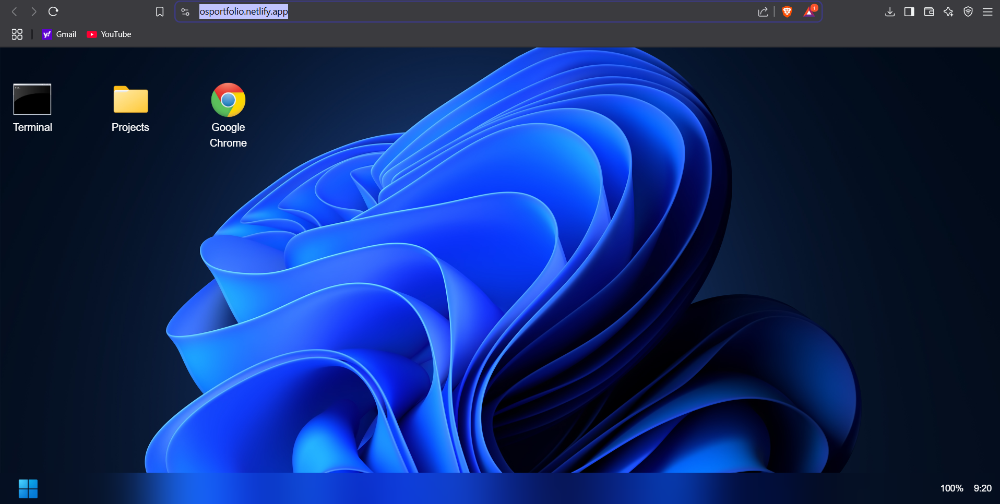
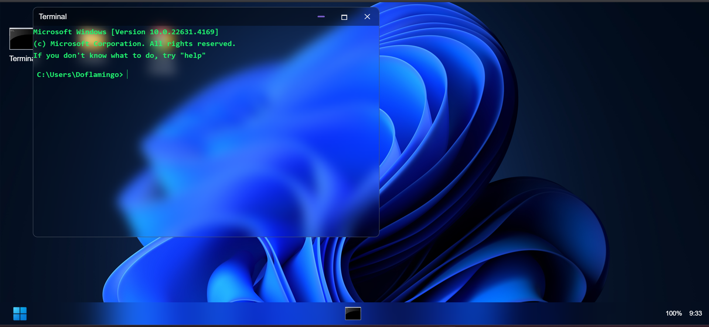

## Last Update
<!--LAST_UPDATED-->
This will be updated automatically.
<!--/LAST_UPDATED-->


<h1>OSPortfolio - Window Themed Terminal Portfolio</h1>






<h2>🖥️ Overview</h2>

OSPortfolio is a Windows-inspired terminal portfolio built using Next.js, designed to function as an interactive, resizable, and customizable personal portfolio.

<h2>🚀 Features (Current & Planned)</h2>

✔ Windows OS UI – A clean, Windows-like interface.<br/>
✔ Interactive Taskbar – Dynamic taskbar with app shortcuts(still in progress).<br/>
✔ Terminal Integration – Type commands to navigate and interact.

<h2>🛠 Planned Features:</h2>

🏗 Support for Other OS Themes (Linux, macOS, etc.)

📂 Folder UI (Includes Resume, Projects, Custom Files)

🔍 Search Bar in Taskbar

📏 Resizable Windows & Apps (Drag to Resize)

🎨 Customizable Themes & Wallpapers

🛠 Multi-Tab Terminal Support

@ Change the files from js to ts.

<h2>🛠 Tech Stack</h2>

Frontend: Next.js, React, Tailwind CSS

📂 Project Structure
```plaintext
/osportfolio
 ├── .idea/                # Project settings (IDE specific)
 ├── .next/                # Next.js build output
 ├── node_modules/         # Dependencies
 ├── out/                  # Static export output
 ├── public/               # Static assets (icons, wallpapers)
 ├── src/
 │   ├── app/              # Main application files
 │   │   ├── favicon.ico
 │   │   ├── globals.css
 │   │   ├── layout.tsx
 │   │   └── page.tsx
 │   ├── components/       # Reusable UI components
 │   │   ├── taskbar/
 │   │   ├── terminals/
 │   │   ├── utils/
 │   │   │   ├── desktop.css
 │   │   │   ├── page.jsx
 │   │   │   ├── FolderApp.tsx
 │   │   │   ├── GoogleApp.tsx
 │   │   │   ├── icon.jsx
 │   │   │   ├── TempTerminal.tsx
 │   │   │   ├── TerminalApp.tsx
 │   │   │   ├── window.tsx
 ├── fonts/                # Font assets
 ├── .eslintrc.json        # ESLint configuration
 ├── .gitignore            # Git ignore file
 ├── next.config.mjs       # Next.js Configuration
 ├── next-env.d.ts         # TypeScript environment settings
 ├── package.json          # Project dependencies
 ├── README.md             # Documentation
```


### 🚀 Installation & Setup
```sh
git clone https://github.com/DiegoDialga/osportfolio.git
cd osportfolio
npm install
npm run dev
```

Then open http://localhost:3000 in your browser.

🤝 Contributions & Feedback

Want to suggest a feature or contribute? Open an issue or a pull request! 🚀!

